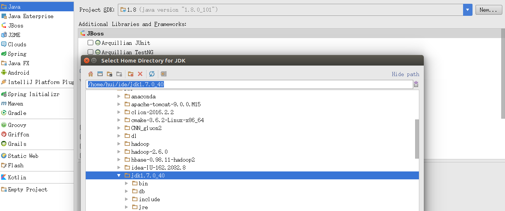
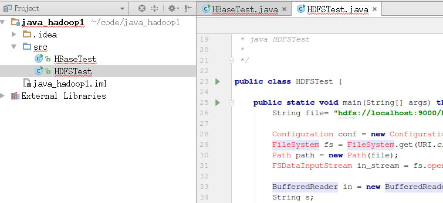
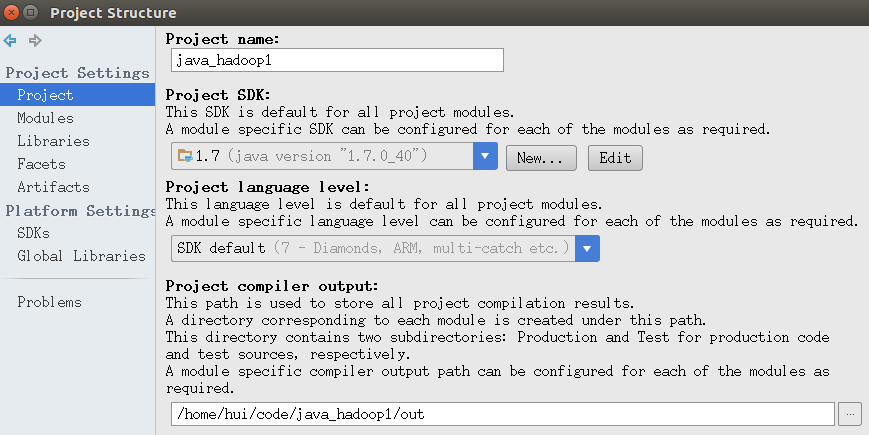
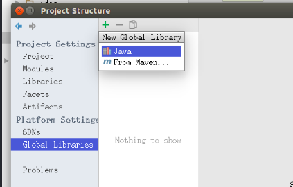
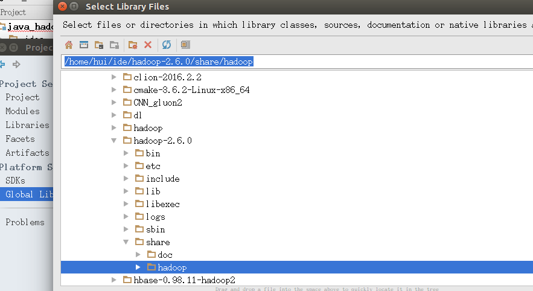
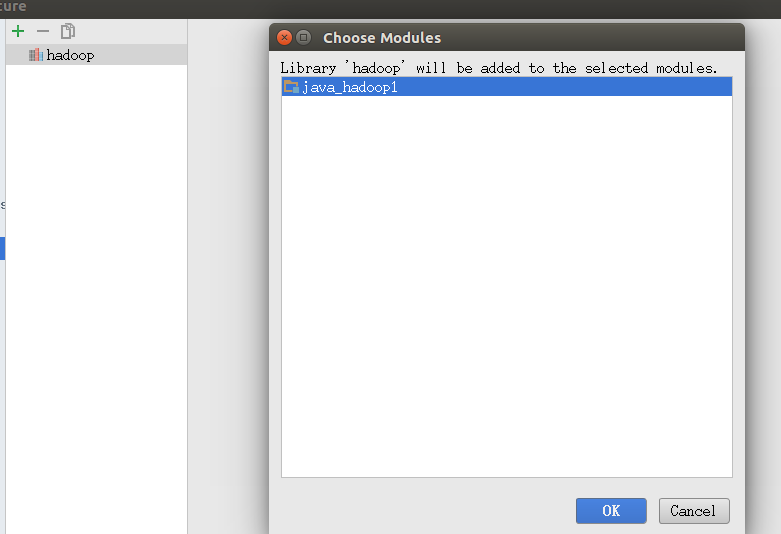
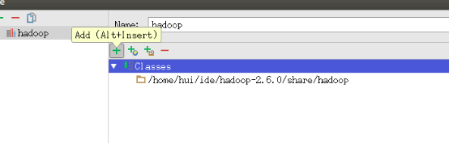
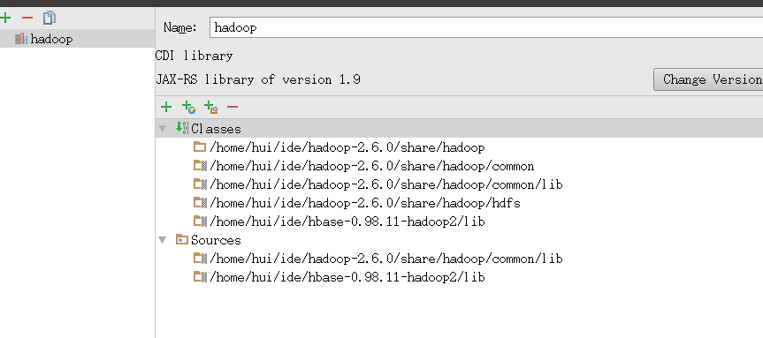
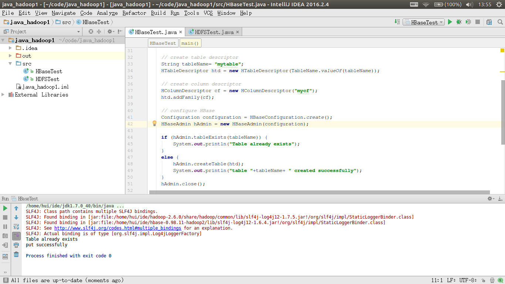

## 在IDEA中编写代码
### 1. 安装IDEA
### 2. 新建一个java项目
1. 注意选择自己装的1.7.0_40版本的jdk<br/>
<br/>
然后一路next,新建项目<br/>

### 3. 复制work/hw1下的java代码到项目的src目录下(注意复制.java文件,不是.class文件)
<br/>
发现有报错,这是因为没有导入需要的jar文件<br/>

### 4. 导入需要的jar文件
选择[File]->[Project Structure]或者(Ctrl+Alt+Shift+S)<br/>
<br/>
选择[Global Libraries],点绿色加号添加java lib<br/>
<br/>
选择{HADOOP_DIR}/share/hadoop/目录<br/>
<br/>
弹出一个框问是否添加到本项目,选择OK<br/>
<br/>
选择右边的加号,继续添加lib<br/>
<br/>
添加{HADOOP_DIR}/share/hadoop/common<br/>
{HADOOP_DIR}/share/hadoop/common/lib<br/>
{HADOOP_DIR}/share/hadoop/hdfs<br/>
添加{HBAE_DIR}/lib<br/>
<br/>

### 5. 运行代码
先在命令行里运行起来HDFS和HBase<br/>
```
start-dfs.sh
start-hbase.sh
```
在打开HDFSTest.java, 在编辑框中右键,选择run, 没有报错就OK了</br>
在打开HBaseTest.java, 在编辑框中右键,选择run, 没有报错就OK了</br>
</br>
